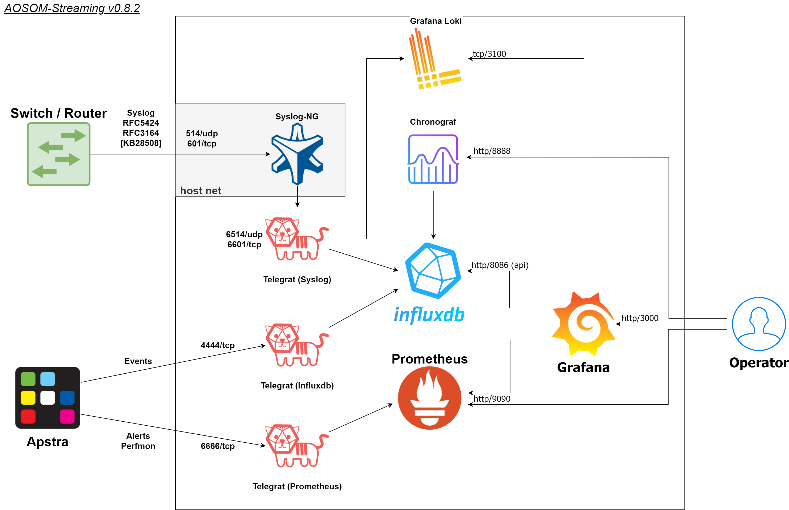

# AOSOM-Streaming
Version v0.8.2 [2021-09-25] 
 
Tested with: [apstra/telegraf:latest | grafana/grafana:8.1.5 | prom/prometheus:2.29.2 | influxdb:1.8.9 | Chronograf 1.9.0] 

## Disclaimer
**WARNING:** This application is for demo purposes only and should not be used in production.

# Overview
The AOSOM Streaming project provides a packaged solution to collect and visualize telemetry streaming information coming from an AOS Server. 
This provides a Web UI experience and example queries to handle alerts, counters, and AOS events. 
This project officially lives on Github at https://github.com/Apstra/aosom-streaming and is open-source. 

The packaged solution includes:  

* Grafana (port 3000) - a graphical Interface based on  
* Prometheus (port 9090) - for Counters and Alerts 
* Influxdb - for Events
* Chronograf - WebUI for InfluxDB (port 8086)
* 3 Telegraf Collectors [Syslog/Prometheus/Influxdb]
* Syslog-NG --or-- Rsyslog (port 514udp/601tcp) - convert RFC3164 -> RFC5424

The application must first be configured by modifying
``.env``, then ``make clean``, ``make start``, ``make init``
to customize the IP addresses to your environment.

# Using Aosom-streaming

## Grafana Web UI
You can browse to the Grafana web UI by visiting http://<aosom-streaming>:3000 
The default username is `admin` password `adminadmin` 
 

The grafana web UI includes two main sections (top left) - Apstra AOS Blueprint, which describes overall telemetry alerts and traffic throughput, as well as individual devices for interface telemetry.  The blueprints will be learned automatically using the AOS ‘telegraf’ docker container and no further configuration is necessary - it should all be automatic. 

In the screenshot above, we can observe traffic in the demo AOS environment, and aggregate CPU, traffic, and errors.
Change the dashboard at the to ‘Apstra AOS Device’ to filter telemetryevents based on specific and individual devices. 

New ‘Apstra AOS Device Interfaces’ allow to look on each interface traffic:

Syslog:

Syslog via Loki:

## Prometheus Web UI

Prometheus is used for alerts and device telemetry counter storage in the
Aosom-streaming appliance.  Prometheus is available by browsing
to http://<aosom-streaming>:9090 

Each of the queries are built dynamically by AOS when incoming events
appear.  Begin typing under ‘execute’ to see example query names.  Starting
with ‘alert’ will tab-complete available alerts that prometheus has received
from AOS. 

 

Here is an example of BGP Neighbors being offline. 

 

## InfluxDB + Chronograf

InfluxDB is used to store AOS events from telemetry streaming.  InfluxDB is
available by viewing chronograf GUI http://<aosom-streaming>:8888 

 

## Syslog

Telegraf is able to process syslog event which are in RFC5424 format. 
To parse Juniper Syslog - we need to use proxy of events RFC3164 (syslog-ng -or- rsyslog). 
Becouse Docker by default use SNAT for incoming packets insid docker0 network. To prevent lose visibility of source address of device - we need to install syslog-ng/rsyslog in host mode and point staticly telegram IP to internal docker network. 
 
http://www.ietf.org/rfc/rfc5424.txt             The Syslog Protocol                             March 2009      Adiscon GmbH 
http://www.ietf.org/rfc/rfc3164.txt             The BSD syslog Protocol                         August 2001     Cisco Systems 
http://www.ietf.org/rfc/rfc3339.txt             Date and Time on the Internet: Timestamps       July 2002       Sun Microsystems 
 
Telegraf =  input UDP/TCP RFC5424 (IETF-syslog) 
            from 1.20 will support also RFC3164 (BSD or legacy-syslog) - unfortunately - it still doesn't work properly in 1.20 version  
 
Syslog-NG = input UDP/TCP RFC3164 (with RFC3339) 
 

# Aosom-Streaming configuration

Configuring telemetry streaming as part of this project only requires editing
the ‘.env’ file and restarting  the containers.  No configuration is
necessary on the AOS server. 

# Aosom-Streaming Application setup

Setting up the Aosom-streaming docker container only requires you to modify
``.env``, and run ``make start``.   

The telegraf project connects to the AOS API and posts an IP:Port that AOS
uses to stream realtime telemetry data back to. 

# Setting up Aosom-streaming

Edit `.env`:

    LOCAL_IP=10.10.10.2

    # AOS Server
    AOS_SERVER=10.10.10.4
    AOS_LOGIN=admin
    AOS_PASSWORD=admin
    AOS_PORT=443

    # Grafana Details
    GRAFANA_LOGIN=admin
    GRAFANA_PASSWORD=adminadmin

    # Prometheus
    INPUT_PORT_PROM=6666

    # InfluxDB
    INFLUXDB_ADMIN_USER=admin
    INFLUXDB_ADMIN_PASSWORD=adminadmin
    INPUT_PORT_INFLUX=4444

<b>Modify variables.env</b>

``AOS_SERVER`` should be the IP address of the AOS server that will send
telemetry data to the aosom-streaming server.  Username, port and password
information can be customized. 

``LOCAL_IP`` should be the IP address assigned to ens33 (first ethernet
interface)  

In this case, this is learned via DHCP on this VM.  See
``ip addr show dev ens33``  

GRAFANA configuration options specify the username and password for the
grafana web UI.

Set up the project with ``make start``, or if making configuration changes, run ``make update``.

    aosom@ubuntu:~/aosom-streaming$ make start
    -- Start all components --
    Creating network "aosomstreaming_default" with the default driver
    Creating volume "aosomstreaming_grafana_data_2" with default driver
    [...]
    aosom@ubuntu:~/aosom-streaming$ make init

# Makefile options

## Start all containers
To start all components, you can execute the command ``make start``

## Initialize Grafana
After the first boot, you need to initialize Grafana with ``make init`` to:

* Configure Datasource
* Upload Dashboards

## Reset project
At any time, you can reset the project but running the command ``make clean``.

    * All components must be stopped before cleaning-up
    * The next time you start the project you'll have to do a `init` again.

# Make options

Other options available for MAKE are:

    Available targets

    help                           This help screen
    start                          Start all components
    stop                           Stop all components
    init                           Create datasources (proxy) in grafana and load Dashboards (grafana-create-source-proxy grafana-load-dashboards)
    grafana-create-source-proxy    Create datasource in proxy mode in Grafana
    grafana-create-source-direct   Create datasource in direct mode in Grafana (use that is grafana cannot access the data)
    grafana-load-dashboards        Load/Reload the Dashboards in Grafana
    update                         Stop all components, Update all images, Restart all components, Reload the Dashboards (stop update-docker start grafana-load-dashboards)
    update-docker                  Update Docker Images
    clean                          Delete Grafana information and delete current streaming session on AOS (clean-docker clean-aos)
    clean-docker                   Delete Grafana information
    clean-aos                      Delete current streaming session on AOS

# Elasticsearch Configuration [not longere developed]

Configuration files for use with Elasticsearch are also included here. The .env file should still be configured as described above. 
To start the Elasticsearch, Kibana and Telegraf containers use: 

    docker-compose -f docker-compose-elasticsearch.yml up -d

# (Optional) Build Aosom-Streaming VM

These are the simple steps to build your own Aosom-streaming VM - at the
end of the day, Aosom-Streaming is only a simple Docker container, and this
guide is only setting up a very basic docker server.

## Install Ubuntu 16.04.2

Download the Ubuntu 16.04.2 ISO and provision a new VM. 

The default username we’ve chosen is ‘aosom’ with password ‘admin’. 
For larger blueprints, Apstra recommends changing RAM to at least 8GB
and 2 vCPU to or more. 

    ========  ========
    Resource  Quantity
    ========  ========
    RAM       8GB
    CPU       2vCPU
    Network   1 vNIC
    ========  ========

## Install required packages
Based on Ubuntu 16.04.2

Run apt-get update::

    apt-get update

Perform a system update to ensure all packages are up to date.::

    aosom@ubuntu:~$ sudo apt-get install docker docker-compose git make curl
        openssh-server
    [sudo] password for aosom:
    Reading package lists... Done
    Building dependency tree
    Reading state information... Done
    The following additional packages will be installed:
      bridge-utils cgroupfs-mount containerd dns-root-data dnsmasq-base docker.io
      git-man liberror-perl libnetfilter-conntrack3 libperl5.22 libpython-stdlib
      libpython2.7-minimal libpython2.7-stdlib libyaml-0-2 patch perl
      perl-modules-5.22 python python-backports.ssl-match-hostname
      python-cached-property python-cffi-backend python-chardet
      python-cryptography python-docker python-dockerpty python-docopt
      python-enum34 python-funcsigs python-functools32 python-idna
      python-ipaddress python-jsonschema python-minimal python-mock
      python-ndg-httpsclient python-openssl python-pbr python-pkg-resources
      python-pyasn1 python-requests python-six python-texttable python-urllib3
      python-websocket python-yaml python2.7 python2.7-minimal rename runc
      ubuntu-fan xz-utils
    Suggested packages:
      mountall aufs-tools btrfs-tools debootstrap docker-doc rinse zfs-fuse
      | zfsutils git-daemon-run | git-daemon-sysvinit git-doc git-el git-email
      git-gui gitk gitweb git-arch git-cvs git-mediawiki git-svn diffutils-doc
      perl-doc libterm-readline-gnu-perl | libterm-readline-perl-perl make
      python-doc python-tk python-cryptography-doc python-cryptography-vectors
      python-enum34-doc python-funcsigs-doc python-mock-doc python-openssl-doc
      python-openssl-dbg python-setuptools doc-base python-ntlm python2.7-doc
      binutils binfmt-support make
    The following NEW packages will be installed:
      bridge-utils cgroupfs-mount containerd dns-root-data dnsmasq-base docker
      docker-compose docker.io git git-man liberror-perl libnetfilter-conntrack3
      libperl5.22 libpython-stdlib libpython2.7-minimal libpython2.7-stdlib
      libyaml-0-2 patch perl perl-modules-5.22 python
      python-backports.ssl-match-hostname python-cached-property
      python-cffi-backend python-chardet python-cryptography python-docker
      python-dockerpty python-docopt python-enum34 python-funcsigs
      python-functools32 python-idna python-ipaddress python-jsonschema
      python-minimal python-mock python-ndg-httpsclient python-openssl python-pbr
      python-pkg-resources python-pyasn1 python-requests python-six
      python-texttable python-urllib3 python-websocket python-yaml python2.7
      python2.7-minimal rename runc ubuntu-fan xz-utils make
    0 upgraded, 54 newly installed, 0 to remove and 3 not upgraded.
    Need to get 32.4 MB of archives.
    After this operation, 174 MB of additional disk space will be used.
    Do you want to continue? [Y/n] y

Add the aosom user to the docker group.  This will allow ‘aosom’
to make docker configuration changes without having to escalate to sudo.

Add user to docker::

    aosom@ubuntu:~/aosom-streaming$ sudo usermod -aG docker aosom
    Log out and log back in again for ‘aosom’ user to be properly added to the group.

Copy the Aosom-streaming docker containers over with ‘git clone’::

    aosom@ubuntu:~$ git clone https://github.com/Apstra/aosom-streaming.git
    Cloning into 'aosom-streaming'...
    remote: Counting objects: 303, done.
    remote: Total 303 (delta 0), reused 0 (delta 0), pack-reused 303
    Receiving objects: 100% (303/303), 64.10 KiB | 0 bytes/s, done.
    Resolving deltas: 100% (176/176), done.
    Checking connectivity... done.
    aosom@ubuntu:~$

## Change system hostname

Modify /etc/hostname to `aosom`, and change the loopback IP in /etc/hosts
to `aosom` from `ubuntu`.

# Troubleshooting

While most troubleshooting information is included in the Github main page at
https://github.com/Apstra/aosom-streaming, we can run some simple commands to
make sure the environment is healthy 

Checking for logs from docker container:

    docker logs aosom-streaming_telegraf-influx_1

We should see a blueprint ID, and some influxdb ‘write’ events when telemetry
events occur on AOS - BGP, liveness, config deviation, etc. 

Viewing docker logs::

    GetBlueprints() - Id 0033cf3f-41ed-4ddc-91f5-ea68318fba9b
    2017-07-31T23:59:13Z D! Finished to Refresh Data, will sleep for 20 sec
    2017-07-31T23:59:15Z D! Output [influxdb] buffer fullness: 11 / 10000 metrics.
    2017-07-31T23:59:15Z D! Output [influxdb] wrote batch of 11 metrics in 5.612057ms
    2017-07-31T23:59:20Z D! Output [influxdb] buffer fullness: 4 / 10000 metrics.
    2017-07-31T23:59:20Z D! Output [influxdb] wrote batch of 4 metrics in 5.349171ms
    2017-07-31T23:59:25Z D! Output [influxdb] buffer fullness: 11 / 10000 metrics.
    2017-07-31T23:59:25Z D! Output [influxdb] wrote batch of 11 metrics in 4.68295ms
    2017-07-31T23:59:30Z D! Output [influxdb] buffer fullness: 4 / 10000 metrics.
    2017-07-31T23:59:30Z D! Output [influxdb] wrote batch of 4 metrics in 5.007029ms
    GetBlueprints() - Id 0033cf3f-41ed-4ddc-91f5-ea68318fba9b
    2017-07-31T23:59:33Z D! Finished to Refresh Data, will sleep for 20 sec

Ensuring all containers are running 

Run ``docker ps`` to see and ensure all the expected containers are running: 

Listing docker containers:

    aosom@ubuntu:~/aosom-streaming$ docker ps
    CONTAINER ID   IMAGE                    COMMAND                  CREATED        STATUS       PORTS                                                                                                                NAMES
    532224e6cb24   apstra/telegraf:latest   "/entrypoint.sh tele…"   39 hours ago   Up 4 hours   8092/udp, 0.0.0.0:6514->6514/tcp, 0.0.0.0:6514->6514/udp, :::6514->6514/tcp, :::6514->6514/udp, 8125/udp, 8094/tcp   aosom-streaming_telegraf-syslog_1
    66719911f05f   apstra/telegraf:latest   "/entrypoint.sh tele…"   40 hours ago   Up 4 hours   8092/udp, 0.0.0.0:6666->6666/tcp, :::6666->6666/tcp, 8125/udp, 8094/tcp                                              aosom-streaming_telegraf-prom_1
    9cc97c0ecb1e   apstra/telegraf:latest   "/entrypoint.sh tele…"   40 hours ago   Up 4 hours   8092/udp, 0.0.0.0:4444->4444/tcp, :::4444->4444/tcp, 8125/udp, 8094/tcp                                              aosom-streaming_telegraf-influx_1
    68e69a22e222   grafana/grafana:latest   "/run.sh"                42 hours ago   Up 4 hours   0.0.0.0:3000->3000/tcp, :::3000->3000/tcp                                                                            aosom-streaming_grafana_1
    decc0649345e   influxdb:latest          "./entrypoint.sh"        42 hours ago   Up 4 hours   0.0.0.0:8086->8086/tcp, :::8086->8086/tcp                                                                            aosom-streaming_influxdb_1
    23f8a415f748   prom/prometheus:latest   "/bin/prometheus --c…"   42 hours ago   Up 4 hours   0.0.0.0:9090->9090/tcp, :::9090->9090/tcp                                                                            aosom-streaming_prometheus_1

Launching the shell inside the container

    docker exec -it aosom-streaming_telegraf-influx_1 bash